## Architecture
<p align="center">
  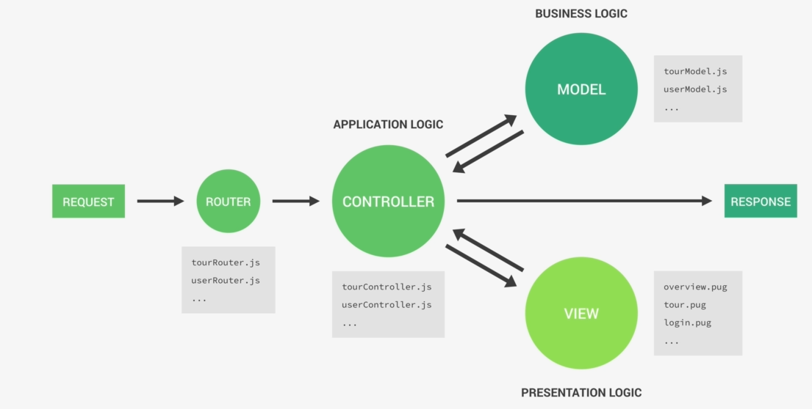
</p>

### Applications vs Business Logic
#### Application Logic
* Code that is only concerned about the application's implementation, not the underlying business problem we're trying to solve (e.g showing and selling tours).
* Concerned about managing requests and responses.
* About the app's more technical aspects.
* Bridge between model and view layers

#### Business Logic
* Code that actually solves the business problem we set out to solve.
* Directly related to business rules, how the business works, and business needs.
* Examples:
  * Creating new tours in the database.
  * Checking if user's password is correct.
  * Validating user input data.
  * Ensuring only users who bought a tour can review it.

<p align="center">
  
</p>

> Fat Models / Thin Controllers: Offload as much logic as possible into the models, and keep the controllers as simple and lean as possible.

## MongoDB
MongoDB is a document database with the scalability and flexibility that you want with the querying and indexing that you need.
<p align="center">
  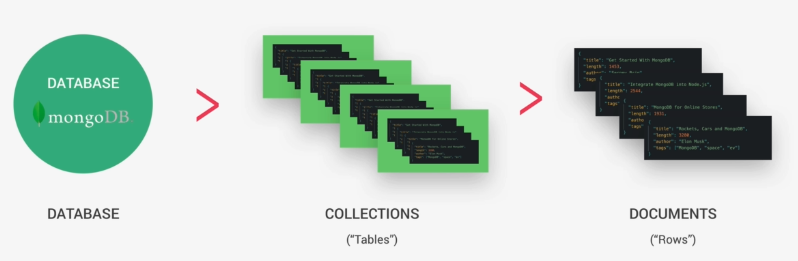
</p>

### Key MongoDB Features
* **Document based**: MongoDB stores data in documents(rows), which are field-value paired data structures like JSON (field-value pair data structures, NoSQL).
* **Scalable**: Very easy to distribute data across multiple machine as your users and amount of data grows.
* **Flexible**: No document data schema required, so each document can have different number and type of fields.
* **Performant**: Embedded data models, indexing, sharding, flexible documents, native duplication, etc.

### Document Structure
MongoDB uses a data format similar to JSON for data storage called BSON.
<p align="center">
  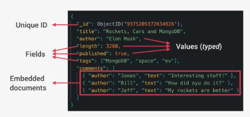
</p>

#### BSON
Data format MongoDB uses for data storage. Like JSON, but **typed**. So MongoDB documents are typed.

Note: The maximum size for each document is currently 16MB.

#### Embedding/Denormalizing
Including related data into a single document. This allows for quicker access and easier data models (it's not always the best solution).

### MongoDB Commands

```shell
# Create or switch Database
$ use <db-name>

# List Databases
$ show dbs

# List collections in DB
$ show collections

# CREATE
# Insert data in collection
$ db.<collection-name>.insertOne({ Object })
$ db.<collection-name>.insertMany([{ Object }, { Object }, …])

# READ
# Queryng all documents in collection
$ db.<collection-name>.find()

# Queryng document with condition
$ db.<collection-name>.find({ attr: 'x' })

# MongoDB operators begin with $
# $lte: less than or equal <=
# $gte: greater than or equal >=
# $lt: less than <
# $gt: greater than >
$ db.<collection-name>.find({ price: {$lte: 500} })

# Search for two search criteria at the same time
# AND
$ db.<collection-name>.find({ price: {$lt: 500}, rating: {$gte: 4.8} })
# OR
$ db.<collection-name>.find({ $or: [ {price: {$lt: 500}}, {rating: {$gte: 4.8}} ] })

# Select in results, just the name property to be in the output
$ db.<collection-name>.find({ $or: [ {price: {$lt: 500}}, {rating: {$gte: 4.8}} ] }, {name: 1})

# UPDATE
# Update parts of the document
$ db.<collection-name>.updateOne({ name: “The Snow Adventure” }, { $set: {price: 597} })
$ db.<collection-name>.updateMany({ price: {$gt: 500}, rating: {$gte: 4.8} }, { $set: {premium: true} })

# Completely replace content of document
$ db.<collection-name>.replaceOne({ ... })
$ db.<collection-name>.replaceMany({ ... })

# DELETE
$ db.<collection-name>.deleteOne({ ... })
$ db.<collection-name>.deleteMany({ rating: {$lt: 4.8} })
# Delete all documents
$ db.<collection-name>.deleteMany({})

# Exit from Mongo Shell
$ quit()
```

### Mongoose
* Mongoose is an Object Data Modeling (ODM) library for MongoDB and Node.js, a higher level of abstraction, allowing for rapid and simple development of MongoDB database interactions.

#### Features
* Schemas to Model data and relationships.
* Easy data validation.
* Simple query API.
* Middleware, etc.

<p align="center">
  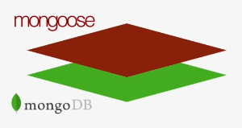
</p>

#### Moongose Schema
Where we model our data, by describing the structure of the data, default values, and validation.

#### Moongose Model
A blueprint for create documents, providing an interface to the database for CRUD operations.

#### Aggregation Pipeline
The aggregation pipeline is a framework for data aggregation modeled on the concept of data processing pipelines. Documents enter a multi-stage pipeline that transforms the documents into aggregated results.

The MongoDB aggregation pipeline consists of stages. Each stage transforms the documents as they pass through the pipeline. Pipeline stages do not need to produce one output document for every input document; e.g., some stages may generate new documents or filter out documents.

<p align="center">
  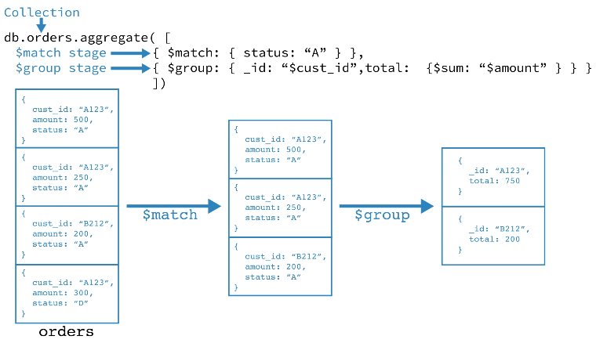
</p>

#### Virtual Properties
In Mongoose, a virtual is a property that is not stored in MongoDB. Virtuals are typically used for computed properties on documents.

```javascript
const userSchema = mongoose.Schema(
  { email: String },
  {
    // By default, Mongoose does not include virtuals when you convert a document to JSON.
    // Set the toJSON schema option to { virtuals: true }.
    toJSON: { virtuals: true }
  }
);
// Create a virtual property `domain` that's computed from `email`.
userSchema.virtual('domain').get(function() {
  return this.email.slice(this.email.indexOf('@') + 1);
});
const User = mongoose.model('User', userSchema);

let doc = await User.create({ email: 'test@gmail.com' });
// `domain` is now a property on User documents.
doc.domain; // 'gmail.com'
```

Mongoose virtuals are not stored in MongoDB, which means you can't query based on Mongoose virtuals.

#### Mongoose Middlewares
Mongoose middleware to make something happen between two events. We can define functions to run before or after a certain event, like saving a document to the database, and that's the reason why Mongoose middleware is also called pre and post hooks.

Mongoose has 4 types of middleware: document middleware, model middleware, aggregate middleware, and query middleware.

##### Document Middleware
Middleware that can act on the currently processed document. In document middleware functions, **this** refers to the document. Runs before **save()** and **create()** (NOT in **insertMany()**).

##### Query Middleware
Allow run functions before or after that a query is executed.

##### Aggregation Middleware
Aggregate middleware executes when you call **exec()** on an aggregate object.

#### Indexes
Indexes support the efficient execution of queries in MongoDB. Without indexes, MongoDB must perform a collection scan, i.e. scan every document in a collection, to select those documents that match the query statement. If an appropriate index exists for a query, MongoDB can use the index to limit the number of documents it must inspect.

##### Example
If we sometimes query for that field but combined with another one, then it's actually more efficient to create a compound index.
```javascript
// 1: means that we're sorting the price index in an ascending order.
// -1: means that we're sorting the price index in an descending order.
modelSchema.index({ slug: 1 });
modelSchema.index({ price: 1, ratingsAverage: -1 });
```
* Basically we need to carefully study the access patterns of our application in order to figure out which fields are queried the most and then set the indexes for these fields.
* Indexes should not be used on small tables.
* Each index needs to be updated each time that the collection is updated. So if you have a collection with a high write-read ratio, then it would make absolutely no sense to create an index on any field in this collection because the cost of always updating the indexand keeping it in memory clearly outweighs the benefit of having the index in the first place if we rarely have searches, so have queries, for that collection.

## Error Handling
There are two types of errors that can occur **Operational Errors** and **Programming Errors**.

### Operational Errors
Operational errors are problems that we can predict will inevitably happen at some point in the future. And so we just need to handle them in advance. They have nothing to do with bugs in our code. Instead, they depend on the user, or the system, or the network.

So, things like a user accessing an invalid route, inputting invalid data, or an application failing to connect to the database. All these are operational errors that we will need to handle in order to prepare our application for these cases.

### Programming Errors
On the other hand, we have programming errors. Which are simply bugs that we developers introduce into our code.

<p align="center">
  
</p>

So, when we're talking about error handling with Express, we mainly just mean operational errors. Because these are the ones that are easy to catch and to handle with our Express application. And Express actually comes with error handling out of the box. So, all we have to do is to write a global express error handling middleware which will then catch errors coming from all over the application.

## JWT
JSON Web Tokens are a Stateless solution for authentication. So there is no need to store any session state on the server which of course is perfect for RESTful APIs. Because RESTful APIs should always be stateless

### How JSON Web Token works?
1. So the user's client starts by making a post request with the username or email and the password.
2. The application then checks if the user exists and if the password is correct. And if so, a unique JWT for only that user is created using a secret string that is stored on a server.
3. The server then sends that JWT back to the client.
4. The client will store it either in a cookie or in local storage. And just like this the user is authenticated and basically logged into our application without leaving any state on the server. So the server does in fact not know which users are actually logged in. But of course, the user knows that he's logged in because he has a valid JSON Web Token which is a bit like a passport to access protected parts of the application.
5. Each time a user wants to access a protected route like his user profile, he send his JWT along with the request. Is like showing his passport to get access to that route.
6. The server will then verify if the Json Web Token is actually valid. So if the user is really who he says he is.
7. If the token is actually valid, then the requested data will be sent to the client and if not, then there will be an error telling the user that he's not allowed to access that resource.

This is how it's gonna work each time that he requests data from any protected route. All this communication must happen over https, in order to prevent that anyone can get access to passwords or JWT.
<p align="center">
  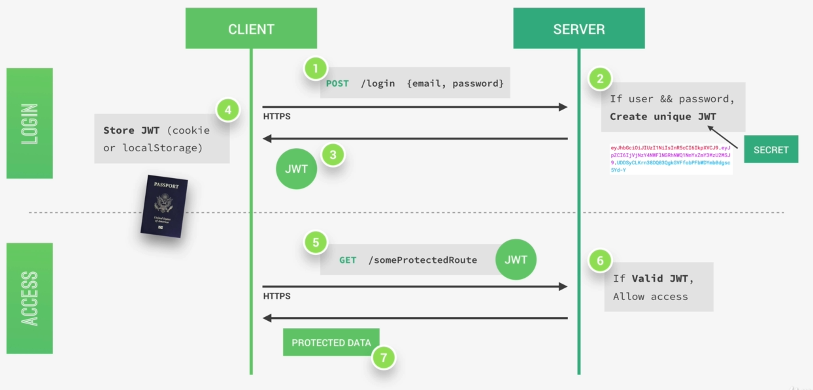
</p>

### What a JWT looks like?
JSON Web Token ISs an encoding string made up of three parts: Header, Payload and Signature.

#### Header
Metadata about the token itself.

#### Payload
The data that we can encode into the token. So the more data encode here, the bigger the JWT. These two parts are just plain text that will get encoded, but not encrypted. So anyone will be able to decode them and to read them. So we cannot store any sensitive data in here.

#### Signature
The signature is created using the header, the payload and the secret that is saved on the server.

<p align="center">
  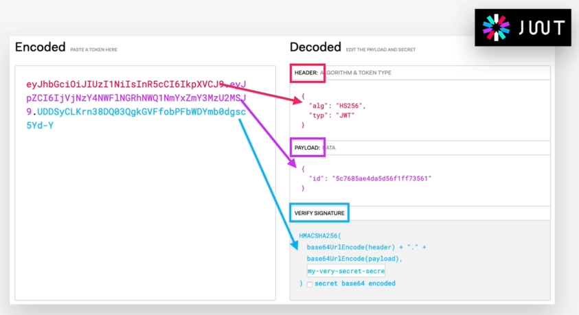
</p>

### How Signing and Verifying works?

#### Signing
The signing algorithm takes the header, the payload and the secret to create a unique signature. Then together with the header and the payload, these signature forms the JWT, which then gets sent to the client.

Once the server receives a JWT to grant access to a protected route, it needs to verify it in order to determine if the user really is who he claims to be. In other words, it will verify if no one changed the header and the payload data of the token. This verification step will check if no third party actually altered either the header or the payload of the JWT.

#### Verifying
Once the JWT is received, the verification will take it's header and payload and together with the secret that is still saved on the server, basically create a **test signature**. Now, we compare the test signature with the original signature that is still in the token. And if the test signature is the same as the original signature, then it means that the payload and the header have not been modified, and we can then authenticate the user.

<p align="center">
  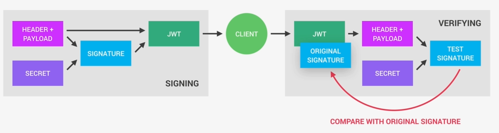
</p>

## Security Best Practices and Suggestions

### Compromised Database
An attacker gained access to our database.
* :white_check_mark: Strongly encrypt passwords with salt and hash (bcrypt)
* :white_check_mark: Strongly encrypt password reset tokens (SHA 256)

### Brute Force Attacks
Where the attacker basically tries to guess a password by trying millions and millions of random passwords until they find the right one.
* :white_check_mark: Use bcrypt (to make login requests slow)
* :white_check_mark: Implement rate limiting, which limits the number of requests coming from one single IP (express-rate-limiting)
* :memo: Implement maximum login attempts

### Cross-Site Scripting (XSS) Attacks
The attacker tries to inject scripts into our page to run his malicious code.
#### Frontend
On the clients' side, this is especially dangerous because it allows the attacker to read the local storage, which is the reason why we should never ever store the JSON web token in local storage. Instead, it should be stored in an HTTPOnly cookie that makes it so that the browser can only receive and send the cookie but cannot access or modify it in any way. And so, that then makes it impossible for any attacker to steal the JSON web token that is stored in the cookie.
* :white_check_mark: Store JWT in HTTPOnly cookies

#### Backend
On the backend side, in order to prevent XSS attacks, we should sanitize user input data and set some special HTTP headers which make these attacks a bit more difficult to happen.
* :white_check_mark: Sanitize user input data
* :white_check_mark: Set special HTTP headers (helmet package)

### Denial-Of-Service (DOS) Attack
It happens when the attacker sends so many requests to a server that it breaks down and the application becomes unavailable.
* :white_check_mark: Implement rate limiting
* :white_check_mark: Limit body payload (in body parser)
* :white_check_mark: Avoid evil regular expressions (could take an exponential time to run for non-matching inputs and they can be exploited to bring our entire application down)

### NOSQL Query Injection
Query injection happens when an attacker, instead of inputting valid data, injects some query in order to create query expressions that are gonna translate to true.
* :white_check_mark: Use mongoose for MongoDB (because of SchemaTypes forces each value to have a well-defined data tab)
* :white_check_mark: Sanitize user input data

### Other Best Practices and Suggestions
* :white_check_mark: Always use HTTPS
* :white_check_mark: Create random password reset tokens with expiry dates
* :white_check_mark: Deny access to JWT after password change
* :white_check_mark: Don't commit sensitive config data to Git
* :white_check_mark: Don't send error details to client
* :memo: Prevent Cross-Site Request Forgery (csurf package) which is an attack that forces a user to execute unwanted actions on a web application in which they are currently logged in
* :memo: Require re-authentication before a high value action, for example, making a payment or deleting something.
* :memo: Implement a blacklist of untrusted JWT
* :memo: Confirm user email address after first creating account
* :memo: Keep user logged in with refesh tokens, which are basically to remember users. So, to keep them logged in forever or until they choose to log out.
* :memo: Implement two-factor authentication
* :white_check_mark: Prevent parameter polution causing Uncaught Exception, for example, try to just insert two field parameters into the query string that searches for all tours.

## Data Modelling

### Types of relationships between data

#### 1:1
When one field can only have one value (1 movie can only have 1 name).
<p align="center">
  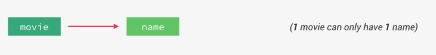
</p>

#### 1:Many
MongoDB distinguish between three types of one to many relationships. So the difference here is based on the relative amount of the many. In relational databases there is just one to many without quantifying how much that many actually is. In MongoDB databases though it is an extremely important difference. Because its one of the factors that we're gonna use to decide if we should denormalize or normalize data.
<p align="center">
  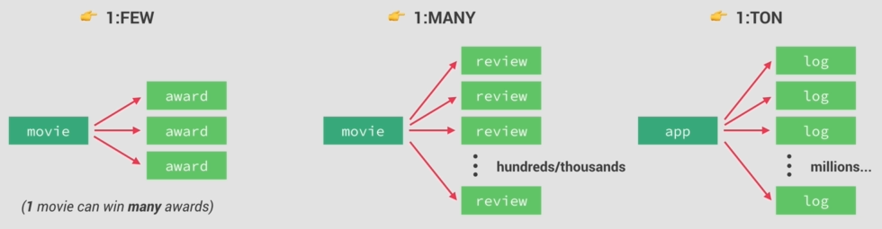
</p>

#### Many:Many
<p align="center">
  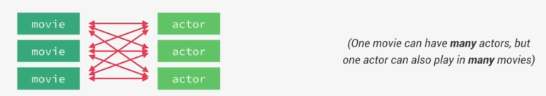
</p>

### Referencing/Normalization vs Embedding/Denormalization
Each time we have two related datasets we can either represent that related data in a reference or normalized form or in an embedded or denormalized form.
<p align="center">
  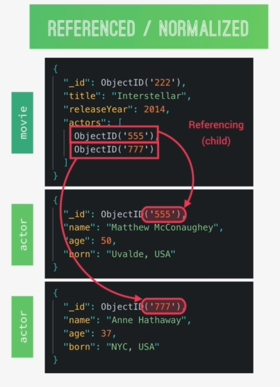
</p>
This type of referencing is called child referencing.
:+1: Performance: It's easier to query each document on its own.
:-1: We need two queries to get data from referenced document.

<p align="center">
  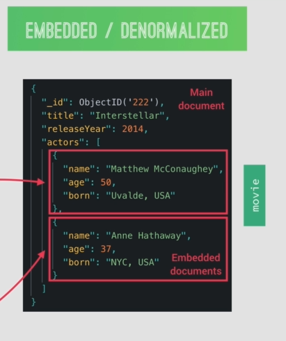
</p>
:+1: Performance: We can get all the information in one query.
:-1: Impossible to query the embedded document on its own.

Note : We could of course begin our thought process with denormlized data and then come to the conclusion that its best to actually normalize the data.

### When to embed and when to reference? A practical framework

Now to actually take the decision; we need to combine all of these three criteria and not just use one of them in isolation. So for example; just because criteria number one says to embed it doesn't mean that we don't need to look at the other two criteria.

#### 1. Relationship Type
* So usually when we have 1:FEW relationship we will always embed the related dataset into the main dataset.
* 1:MANY; things are a bit more fuzzy so its okay to either embed or reference. In that case we will have to decide according to the other two criteria.
* 1:TON or MANY:MANY relationship we usually always reference the data. That's because if we actually did embed in this case we could quickly create way too large document. Even potentially surpassing the maximum of 16 megabytes.

#### 2. Data Access Pattern
Evaluate whether a certain dataset is mostly written to or mostly read from.
* So if the dataset that we're deciding about is mostly read and the data is not updated a lot then we should probably embed that dataset.
* A high read/write ratio just means that there is a lot more reading than writing. And a again, a dataset like that is a good candidate for embedding. The reason for this is that by embedding we only need one trip to the database per query. While for referencing we need two trips.
* Now on the other hand, if our data is updated a lot then we should consider referencing or normalizing the data. That's because its more work for the database engine to update and embed a document than a more simple standalone document.

#### 3. Data Closeness
Which is just like a measure for how much the data is related.

Example; All users can have many email addresses on their account and since they are so intrinsically connected to the user, there is no doubt emails should be embedded into the document. Now if we frequently need to query both of datasets on their own then that's a very good reason to normalize the data into two separate datasets. Even if they are closely related.

<p align="center">
  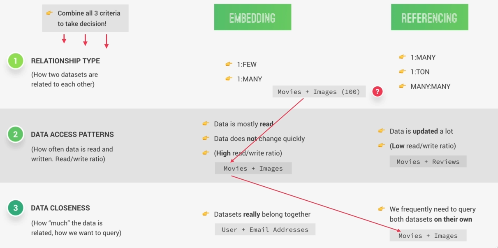
</p>

### Types of referencing
Now, lets say that we have chosen to normalize our datasets. So in other words to reference data. Then after that we still have to choose between three different types of referencing.

#### Child Referencing
So in child referencing; we basically keep references to the related child documents in a parent document. However, the problem here is that this array of IDs can become very large if there are lots of children. And this is an anti-pattern in MongoDB.

<p align="center">
  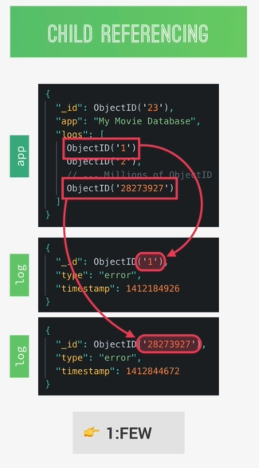
</p>

#### Parent Referencing
In parent referencing; it actually works the other way around. Here in each child document we keep a reference to the parent element. It is way more isolated and more standalone.

<p align="center">
  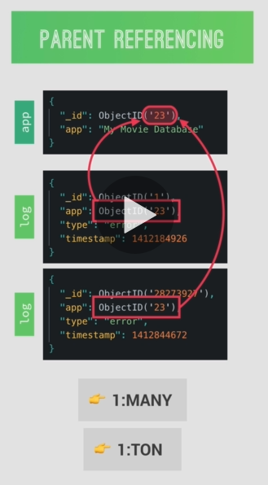
</p>

#### Two-Way Referencing
Usually use this two-way referencing to design many to many relationships.

<p align="center">
  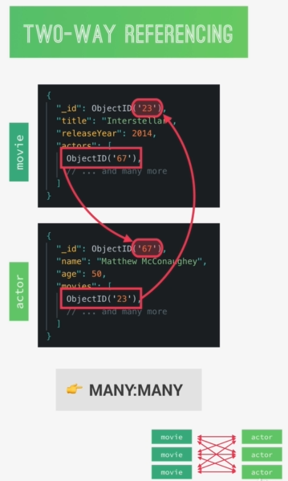
</p>

#### Conclusion
* Child referencing is best used for one to a few relationships. Where we know before hand that the array of child documents won't grow that much. On the other hand, parent referencing is best used for one to many and one to a ton relationships.

* Note: Keep in mind that one of the most important principals of MongoDB data modeling is that array should never be allowed to grow indefinitely. In order to never break that 16 megabyte limit.

### Summary

* The most important principle is: Structure your data to **match the ways that your application queries and updates data**.
* In other words: Identify the questions that arise from your **application's use cases** first, and then model your data so that the **questions can get answered** in the most efficient way.
* In general, **always favor embedding**, unless there is a good reason not to embed. Especially on 1:FEW and 1:MANY relationships.
* A 1:TON or a MANY:MANY relationships is usually a good reason to **reference** instead of embedding.
* Also, favor **referencing** when data is updated a lot and if you need to frequently access a dataset on its own.
* Use **embedding** when data is mostly read but rarely updated, and when two datasets belong intrinsically together.
* Don't allow arrays to grow indefinitely. Therefore, if you need to normalize, use **child referencing** for 1:MANY relationships, and **parent referencing** for 1:TON relationships.
* Use **two-way referencing** for MANY:MANY relationships.

## Data Model
<p align="center">
  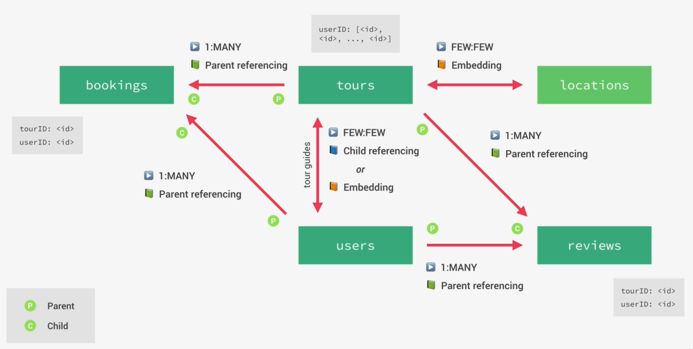
</p>
