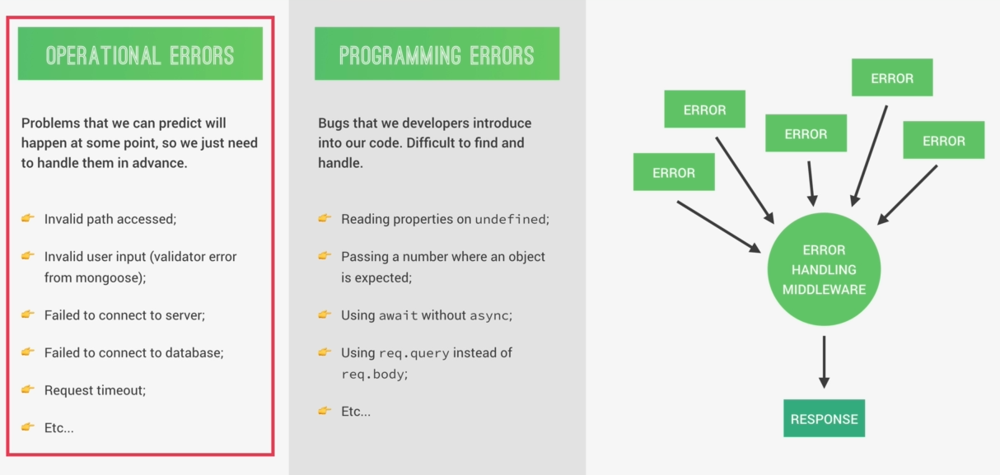

## Architecture
<p align="center">
  
</p>

### Applications vs Business Logic
#### Application Logic
* Code that is only concerned about the application's implementation, not the underlying business problem we're trying to solve (e.g showing and selling tours).
* Concerned about managing requests and responses.
* About the app's more technical aspects.
* Bridge between model and view layers

#### Business Logic
* Code that actually solves the business problem we set out to solve.
* Directly related to business rules, how the business works, and business needs.
* Examples:
  * Creating new tours in the database.
  * Checking if user's password is correct.
  * Validating user input data.
  * Ensuring only users who bought a tour can review it.

<p align="center">
  
</p>

> Fat Models / Thin Controllers: Offload as much logic as possible into the models, and keep the controllers as simple and lean as possible.

## MongoDB
MongoDB is a document database with the scalability and flexibility that you want with the querying and indexing that you need.
<p align="center">
  
</p>

### Key MongoDB Features
* **Document based**: MongoDB stores data in documents(rows), which are field-value paired data structures like JSON (field-value pair data structures, NoSQL).
* **Scalable**: Very easy to distribute data across multiple machine as your users and amount of data grows.
* **Flexible**: No document data schema required, so each document can have different number and type of fields.
* **Performant**: Embedded data models, indexing, sharding, flexible documents, native duplication, etc.

### Document Structure
MongoDB uses a data format similar to JSON for data storage called BSON.
<p align="center">
  
</p>

#### BSON
Data format MongoDB uses for data storage. Like JSON, but **typed**. So MongoDB documents are typed.

Note: The maximum size for each document is currently 16MB.

#### Embedding/Denormalizing
Including related data into a single document. This allows for quicker access and easier data models (it's not always the best solution).

### MongoDB Commands

```shell
# Create or switch Database
$ use <db-name>

# List Databases
$ show dbs

# List collections in DB
$ show collections

# CREATE
# Insert data in collection
$ db.<collection-name>.insertOne({ Object })
$ db.<collection-name>.insertMany([{ Object }, { Object }, …])

# READ
# Queryng all documents in collection
$ db.<collection-name>.find()

# Queryng document with condition
$ db.<collection-name>.find({ attr: 'x' })

# MongoDB operators begin with $
# $lte: less than or equal <=
# $gte: greater than or equal >=
# $lt: less than <
# $gt: greater than >
$ db.<collection-name>.find({ price: {$lte: 500} })

# Search for two search criteria at the same time
# AND
$ db.<collection-name>.find({ price: {$lt: 500}, rating: {$gte: 4.8} })
# OR
$ db.<collection-name>.find({ $or: [ {price: {$lt: 500}}, {rating: {$gte: 4.8}} ] })

# Select in results, just the name property to be in the output
$ db.<collection-name>.find({ $or: [ {price: {$lt: 500}}, {rating: {$gte: 4.8}} ] }, {name: 1})

# UPDATE
# Update parts of the document
$ db.<collection-name>.updateOne({ name: “The Snow Adventure” }, { $set: {price: 597} })
$ db.<collection-name>.updateMany({ price: {$gt: 500}, rating: {$gte: 4.8} }, { $set: {premium: true} })

# Completely replace content of document
$ db.<collection-name>.replaceOne({ ... })
$ db.<collection-name>.replaceMany({ ... })

# DELETE
$ db.<collection-name>.deleteOne({ ... })
$ db.<collection-name>.deleteMany({ rating: {$lt: 4.8} })
# Delete all documents
$ db.<collection-name>.deleteMany({})

# Exit from Mongo Shell
$ quit()
```

### Mongoose
* Mongoose is an Object Data Modeling (ODM) library for MongoDB and Node.js, a higher level of abstraction, allowing for rapid and simple development of MongoDB database interactions.

#### Features
* Schemas to Model data and relationships.
* Easy data validation.
* Simple query API.
* Middleware, etc.

<p align="center">
  
</p>

#### Moongose Schema
Where we model our data, by describing the structure of the data, default values, and validation.

#### Moongose Model
A blueprint for create documents, providing an interface to the database for CRUD operations.

#### Aggregation Pipeline
The aggregation pipeline is a framework for data aggregation modeled on the concept of data processing pipelines. Documents enter a multi-stage pipeline that transforms the documents into aggregated results.

The MongoDB aggregation pipeline consists of stages. Each stage transforms the documents as they pass through the pipeline. Pipeline stages do not need to produce one output document for every input document; e.g., some stages may generate new documents or filter out documents.

<p align="center">
  
</p>

#### Virtual Properties
In Mongoose, a virtual is a property that is not stored in MongoDB. Virtuals are typically used for computed properties on documents.

```javascript
const userSchema = mongoose.Schema(
  { email: String },
  {
    // By default, Mongoose does not include virtuals when you convert a document to JSON.
    // Set the toJSON schema option to { virtuals: true }.
    toJSON: { virtuals: true }
  }
);
// Create a virtual property `domain` that's computed from `email`.
userSchema.virtual('domain').get(function() {
  return this.email.slice(this.email.indexOf('@') + 1);
});
const User = mongoose.model('User', userSchema);

let doc = await User.create({ email: 'test@gmail.com' });
// `domain` is now a property on User documents.
doc.domain; // 'gmail.com'
```

Mongoose virtuals are not stored in MongoDB, which means you can't query based on Mongoose virtuals.

#### Mongoose Middlewares
Mongoose middleware to make something happen between two events. We can define functions to run before or after a certain event, like saving a document to the database, and that's the reason why Mongoose middleware is also called pre and post hooks.

Mongoose has 4 types of middleware: document middleware, model middleware, aggregate middleware, and query middleware.

##### Document Middleware
Middleware that can act on the currently processed document. In document middleware functions, **this** refers to the document. Runs before **save()** and **create()** (NOT in **insertMany()**).

##### Query Middleware
Allow run functions before or after that a query is executed.

#### Aggregation Middleware
Aggregate middleware executes when you call **exec()** on an aggregate object.

## Error Handling
There are two types of errors that can occur **Operational Errors** and **Programming Errors**.

### Operational Errors
Operational errors are problems that we can predict will inevitably happen at some point in the future. And so we just need to handle them in advance. They have nothing to do with bugs in our code. Instead, they depend on the user, or the system, or the network.

So, things like a user accessing an invalid route, inputting invalid data, or an application failing to connect to the database. All these are operational errors that we will need to handle in order to prepare our application for these cases.

### Programming Errors
On the other hand, we have programming errors. Which are simply bugs that we developers introduce into our code.

<p align="center">
  
</p>

So, when we're talking about error handling with Express, we mainly just mean operational errors. Because these are the ones that are easy to catch and to handle with our Express application. And Express actually comes with error handling out of the box. So, all we have to do is to write a global express error handling middleware which will then catch errors coming from all over the application.